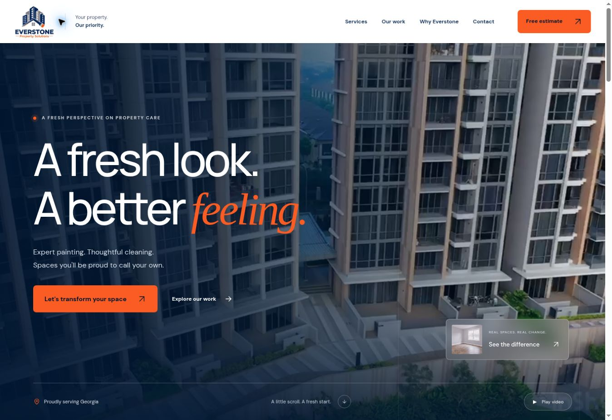

# Everstone Property Solutions

Live website: https://everstoneps.com/

Static HTML, CSS, and JavaScript, served by GitHub Pages. No build step or runtime dependencies.

## Local preview

Run `python3 -m http.server 8000` from the repository, then open http://localhost:8000.

`docs/responsive-preview.html` contains 390 px and 320 px frames for checking the mobile layout.

## Website behavior

- Original navy (`#04264F`) and orange (`#FA5C23`) brand colors, logo, video, project photos, domain, and contact destinations are retained.
- The background video has play/pause controls. It pauses offscreen and when the browser tab is hidden; reduced-motion and data-saving preferences disable automatic playback.
- Four original project photos can be compared with a native keyboard-accessible range control. Original uncropped photos remain available.
- Estimate details only compose `sms:` and `mailto:` links on the visitor's device. The visitor reviews and sends in their own app. There is no server submission or stored lead data.
- Navigation, contact links, static project imagery, and written content remain available without JavaScript.

## Verification

Reviewed in a Chromium desktop browser and at 390 px and 320 px frame widths. Checked navigation, mobile menu open/close, all four gallery selections, slider keyboard endpoints, service preselection, generated email/text requests, original contact links, and horizontal overflow. Message links were inspected without sending a message. Physical iOS/Android messaging apps were not exercised.

